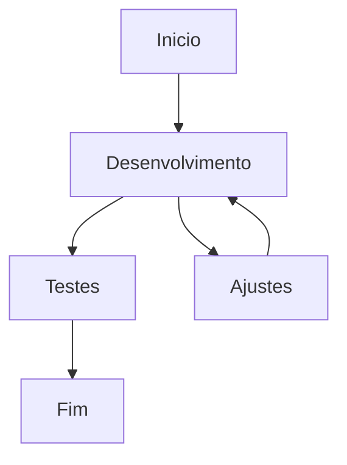

# Arquivo de configuração para Markdowns.MD

Esse arquivo tem como intuito armazenar as regras de formatação para arquivos .MD, para melhor documentação de todo o processo.

## Títulos 📄

As regras para definir os títulos que serão criados e organizados em um índice automaticamente pelo GitHub são:
```
# Título de primeiro nível, maior.
## Título de segundo nível, médio
### Título de terceiro nível, pequeno
```
> [!NOTE]
> É preciso ter um espaço entre o *#* e o *Título* para funcionar.

---

## Quebra de Linhas ➖

É possível fazer uma quebra de linhas com qualquer uma das marcações abaixos
```
---
___
***
```

---

## Formatação de Texto 🛠️

Regras para formatação de texto em MarkDown, podendo ser mesclado entre eles.
Seguindo o código e logo abaixo o resultado

<table>
  <tr>
    <th>Nome</th>
    <th>Caracter</th>
    <th>Exemplo</th>
    <th>Resultado</th>
  </tr>
  <tr>
    <td>Negrito</td>
    <td>** ou __</td>
    <td>**Testando**</td>
    <td><strong>Negrito</strong></td>
  </tr>
  <tr>
    <td>Itálico</td>
    <td>* * ou _ _</td>
    <td>* *Itálico* *</td>
    <td><em>Itálico</em></td>
  </tr>
  <tr>
    <td>Tachado</td>
    <td>~~</td>
    <td>~~Tachado~~</td>
    <td><strike>Tachado</strike></td>
  </tr>
  <tr>
    <td>Subscrito</td>
    <td>Entre tags sub e /sub</td>
    <td><sub>Subscrito</sub></td>
  </tr>
  <tr>
    <td>Sobrescrito</td>
    <td>Entre tags sup e /sup</td>
    <td><sup>Sobrescrito</sup></td>
  </tr>
</table>

---

## Referências e Códigos 📜

As referências podem ser visualizadas com \>
>Este texto é referenciado.

Quanto maior o número de linhas com \>, maior a referência.

### Citar Código 📑

Os códigos podem ser citados com o uso de \`, podendo estar na linha inteira ou apenas em parte do código.
`Aqui o código fica na linha inteira`
Assim podemos por apenas `parte do código` em meio a um texto.

### Bloco de código 📑

Utilizando três vezes a acentuação \``` podemos criar um bloco de código, como um comentário em linguagem de programação.
```
Começamos o código assim
E ele segue por diferentes linhas
até fechar como desejado
```

### Bloco de Código com Linguagem Específica 🌐

Se precisar que mostre o código como linguagem específica para facilitar a leitura, basta definir a linguagem após os \```HTML, por exemplo

```html
<!doctype html>
<html>
<head>
</head>
<body>
</body>
</html>
```

---

## Diagramas com Mermaid

É possível fazer um diagrama com Mermaid, ele interpreta o código e gera a visualização. o código funcionaria com a seguinte sintaxe:
```
graph TD;
  Inicio-->Desenvolvimento;
  Desenvolvimento-->Testes;
  Desenvolvimento-->Ajustes;
  Ajustes-->Desenvolvimento;
  Testes--> Fim;
``` 

A visualização ficaria assim:


Mais Diagramas em [Criação de Diagramas](https://docs.github.com/pt/get-started/writing-on-github/working-with-advanced-formatting/creating-diagrams)

---

## Referências de Cores 🎨

É possível referenciar cores através de aspas invertidas \`, como por exemplo \`#FFFFFF\`
É possível fazer com três tipos:
```
#RRGGBB
rgb(R,G,B)
hsl
```

O destino ficaria `#ffffff` ou `#0969DA`

<span style="color:red">some **This is Red Bold.** text</span>
<font color="red">Testing</font>
